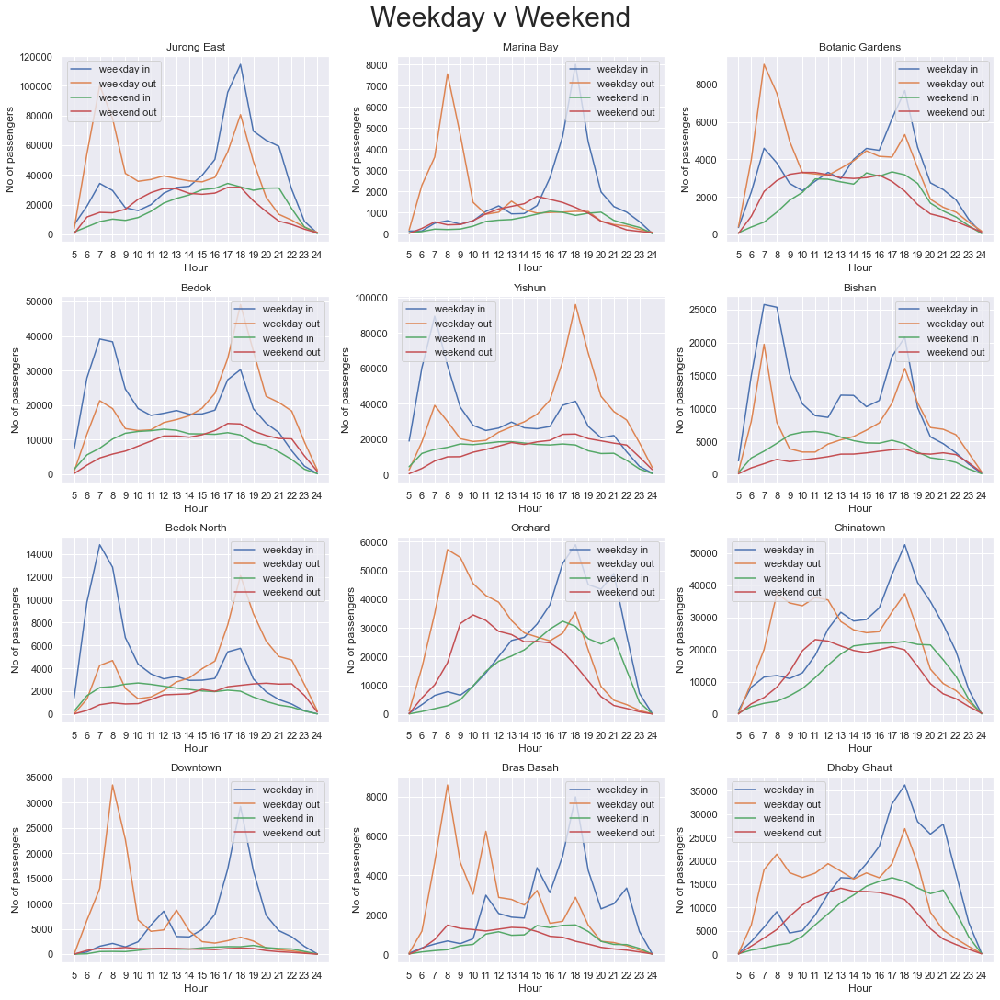
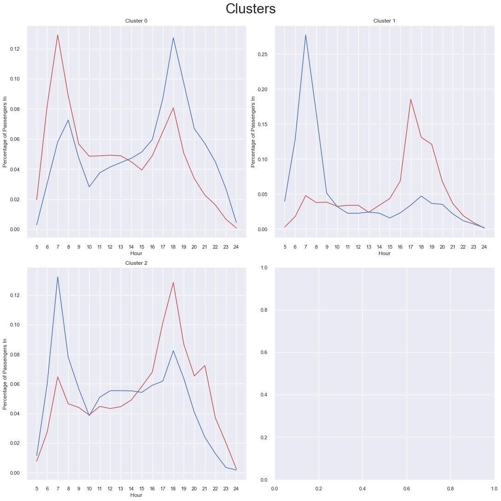

# Trains

## Problem Statement
Problem Statement: How can we model passenger traffic at future MRT stations for enhanced urban planning strategies?

By utlising data from open sources (LTA Datamall, OneMap, Department of Statistics Singapore, data.gov.sg), we aim to develop a ML model that can better cluster and predict station features and passenger traffic patterns. 

# Data Analysis
In the inital exploration of our data, we noticed that the plots of tap-in and tap-out for each station followed certain trends. In the `trains.ipynb`, we managed to narrow down some of these trends into plots that could be broken down into the districts that the stations were in. For example, in a business district, there were usually high tap outs only during the night when people leave their workplace, and high tap-ins during the morning, when people arrive for work.On the other hand, residential districts had almost an inverse effect on this.

 

In the graph above, a business district like _Downtown_ showcases very stark of people exiting the station in the day to leave at night, while a residential district like _Bedok_ has the opposite trend, of people entering the station only to come back at night.

# Clustering
With such stark trends, it appears to be easy to cluster them. We chose to use K-means clustering and an automated elbow method to group clusters together. Dynamic Time Warping is used to account for time delays in trends, and itself is a more robust solution than typical eculidean measurements.

 

By analysing how the cluster centers look like, we can understand what type of station falls under each cluster.

### Cluster 1: Residential
High exits in the morning and high entranecs at night. Though peaks are not as apparant as cluster 2, residential districts likely have high variances as Singapore does not zone districts to be strictly a type.

### Cluster 2: Purely Industrial
Very distict peaks of high entrances in the morning and high exits at night. No one stays in these locations once work is completed.

### Cluster 3: Mixed Industrial Residential, Maininly Industrial
High exits in the morning and high entranecs at night. Peaks are not as distinct, and these stations may be a mix of residential and industrial zones.

# Prediction and more Data Scraping

Having examined all the clusters, we want to predict future stations to estimate the time-specific traffic. To do so, we would need to scrape data.

**Data we scraped:**
- Station Geodata
    - Latitude and logitude (Mostly used for other data scraping)
    - _**Method:**_
        - One Map API query
- Population
    - A high population could indicate a residential cluster
    - _**Method:**_
        - data.gov (Geodata of subzones + subzone data) + cross reference station location
- Bus
    - No of unique bus services in a 1km radius of MRT
    - Busses serve as feeder to MRT stations. High number of feeder bus services could indicate a residential zone
    - _**Method:**_
        - Scrape from One Map API
- Interchange
    - Binary data (1,0) of whether station was a bus or mrt interchange
    - Could indicate high influxes of passengers
    - _**Method:**_
        - Manual addition
- Ammenities
    - Grocery and malls, to find out number of ammenities/min dist to ammenities
    - _**Method:**_
        - Grocery: Data.gov + One Map API query
        - Map: [Wikipedia LIst]("https://en.wikipedia.org/wiki/List_of_shopping_malls_in_Singapore") + One Map API Query
        - **KD trees** to calc min dist
        - **Spatial intersection** for no. of ammenities
- Transport Hub
    - Distance from the nearest of 4 transport nodes (as defined by the government)
    - _**Method:**_
        - One map query + Geopandas
- Businesses
    - Number of busineses in a 3km radius
    - _**Method:**_
        - Data.gov ACRA dataset (postal code) + onemap query

**Prediction**

With mostly numerical data, we have to predict a categorical response variable (cluster). Methods of doing so include decision trees, logistic regression and discriminant analysis. High number of inputs means that a more fine tuned approach would be required. As expected, decision tree returned poor accuracy. 

We tuned the hyperparameters for the other two models and found discriminant analysis to be the most robust. Solver was the eigen solver.

# Organisation

We started with trains.ipynb for the inital EDA. All other notebooks are situated inside their relevant folders, and some of the data that we scraped is found under the **_Data_** directory.

Also included is the powerpoint slide used for our presentation, and 2 videos that we unfortunately had to cut. They depict the changing passenger volume in a time series and geospatial manner.

# Appendix
**Slide template was created in house by our team.**
